# Vehicle Detection

The objective of this project is to create a model to draw bounding boxes around cars in a video.  
This video was taken from a camera mounted on the front of a car.  

This README contains info on:  

1. Files in this repo
2. Project Outline
3. Project Process
   * Histogram of Oriented Gradients
   * Sliding Window Search
   * Video Implementation: Removing False Positives and Combining Overlapping Detections
4. Discussion

## Files in this repo
* `VehicleDetection.ipynb`: Notebook with final model
* `output_images/proc_project_video.mp4`: Result video file
* `output_images/*.png`: Images from different points of model run
* `test_images`: Images provided by Udacity to test the model on

## Project Outline
The goals / steps of this project are the following:

* Perform a Histogram of Oriented Gradients (HOG) feature extraction on a labeled training set of images and train a classifier Linear SVM classifier  
* Optionally, apply a color transform and append binned color features, as well as histograms of color, to the HOG feature vector.   
* Normalize features and randomize a selection for training and testing.
* Implement a sliding-window technique and use trained classifier to search for vehicles in images.
* Run pipeline on a video stream and create a heat map of recurring detections frame by frame to reject outliers and follow detected vehicles.
* Estimate a bounding box for vehicles detected.

## Project Process

### Histogram of Oriented Gradients (HOG), other features and training

#### Read in all `vehicle` and `non-vehicle` images.
Here are example images, the first from the `vehicle` class and the second from the `non-vehicle` class:
    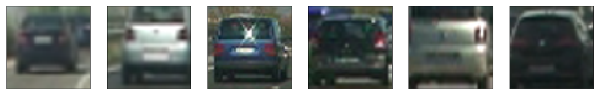  
    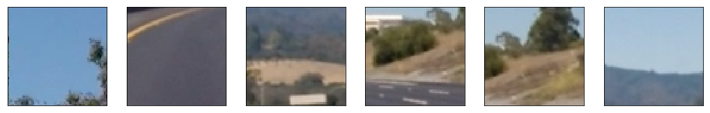  

#### Choose HOG parameters.

I initially used the RGB channels for my HOG, color binning, and color histogram feature extractions,   
but found that the YCrCb channels worked better.  

HOG parameters:  
* Colorspace for HOG features:  YCrCb  
* Number of orientations:  12
* Pixels per cell:  (8, 8)
* Cells per block:  (2, 2)
* Cells per step:  2
* Block normalization method:  L1
* HOG channel(s) used:  ALL

Here are examples of HOG images: 
    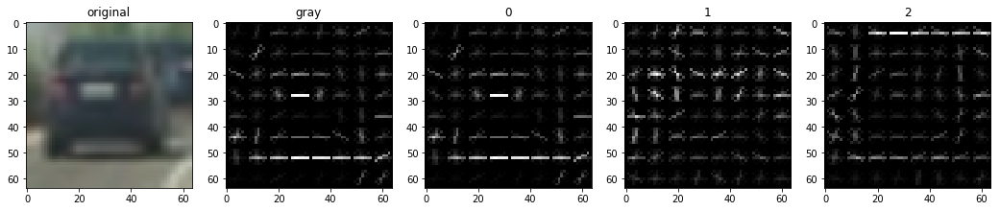   
    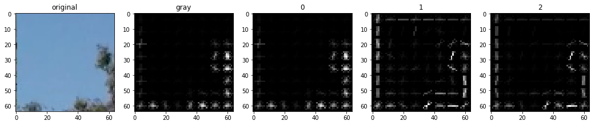   
    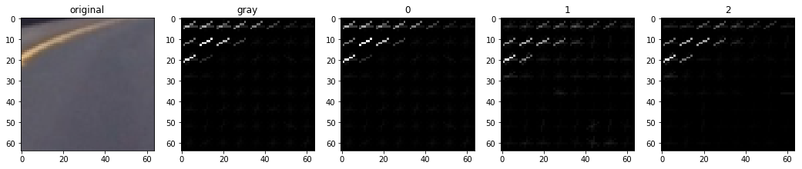   

I trained a linear SVM with C = 1 and used HOG features, binned color features, and color histogram features.

Relevant functions are in `Feature extraction` cells.

### Sliding Window Search

#### Implement a sliding window search.

Sliding windows were calculated with class Region and predefined list of regions 'test_regions '.  
Search space were restricted by lower half of images: [380: 656].  
I used 2 regions:
    Region(Window(x1=0, y1=0, x2=1280, y2=120), (96,96), 12, 1.5),
    Region(Window(x1=0, y1=32, x2=1280, y2=286), (128,128), 16, 2)

For each sliding window:  
* extract features :
  I used the YCrCb channels (all 3 of them), HOG, color binning, and color histogram features.  
* scale extracted features to be fed to the classifier  
* predict whether the window contains a car using our trained Linear SVM classifier  
* save the window if the classifier predicts there is a car in that window  

Small performance optimization:  
* HOG features were calculated once per frame per search region. 
* Sliding windows were processed in chunks using 'process pool'  
  
##### Sliding windows coverage  
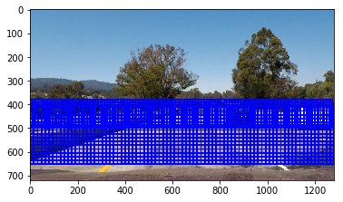  

##### Classifier on sample images  
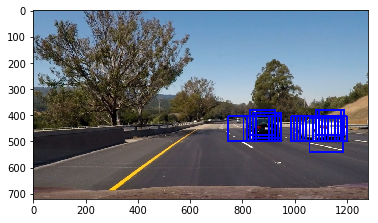  
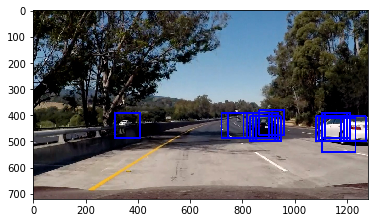  
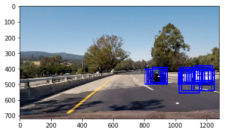  

#### False positives filter

To filter false positives heat map approach was used.

##### Heatmap on sample images  
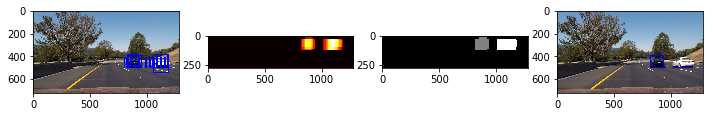  
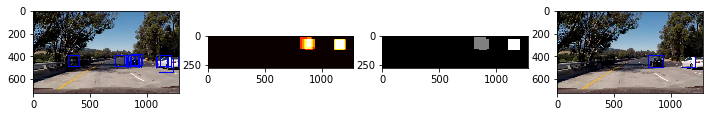  
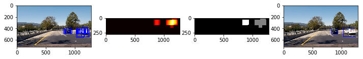  

### Video Implementation

Video processing was implemented in VehicleDetector class.   

Pipeline was implemented in the 'process' method.  
By applying the following steps to every frame:  
* 'find_candidates' method to apply classifier 
* 'filter_candidates' method to remove false positive and smooths the boxes from frame to frame in the video.  
   When information about previous vehicles is provided, this function does:  
   1. Apply heatmap and threashold = 2 to current map
   2. Combine current frame heatmap with previous frames
   3. Take average with threashold = 3 
* 'draw' method to draw rectangles around cars.  

##### Result 
 

### Discussion

In my openion that model has the following weaknesses:  
* False positives - some other improvements are required for model generalization.
* Performance. I did a lot of small optimizations but was not able to make it acceptable for real world.

### Addendum

I have changed skimage hog to cv2 implementation and as result:  
* Performace improved about 2 times
* Number of false positives reduced dramatically
* Unfortunately I was not keep HOG exctraction per frame: that I will work next.  
